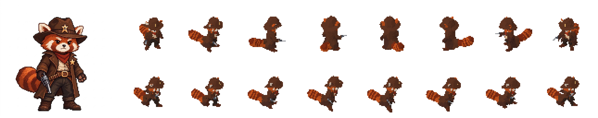

# pseudo-pixel

Turn a reference image (a character, a creature, a vehicle, a prop) into pixel-art spritesheets. A coding
agent generates a 3D model of it, rigs and colours it, turns it into a PS1-style low-poly model, animates it, and renders
the motion small from 8 directions in Blender.



**reference -> 3D mesh (TripoSG) -> rig -> paint -> PS1 low-poly model -> animations -> spritesheets**

## Setup

1. Install [Blender](https://www.blender.org/) 5.2 or newer.
2. Clone this repository.
3. Set up the image-to-3D generator, [TripoSG](https://github.com/VAST-AI-Research/TripoSG) (MIT), next
   to it. It needs an NVIDIA GPU (tested on an RTX 3060 12 GB); its weights (~8 GB) download on first
   use. From the folder that holds this repository:

   ```
   mkdir pp-gen && cd pp-gen
   git clone https://github.com/VAST-AI-Research/TripoSG
   python -m venv venv
   venv/Scripts/pip install torch torchvision --index-url https://download.pytorch.org/whl/cu126
   venv/Scripts/pip install diffusers transformers einops huggingface_hub opencv-python trimesh omegaconf scikit-image peft jaxtyping typeguard pymeshlab
   ```

   (`venv/bin/pip` on Linux and macOS. Elsewhere: set `PP_TRIPOSG` to the TripoSG folder and
   `PP_GEN_PYTHON` to that environment's Python.)
4. Give your agent the skill:
   - **Claude Code:** run it in the clone, or `/plugin marketplace add craigrusselltiu/pseudo-pixel`,
     then `/plugin install pseudo-pixel@pseudo-pixel`.
   - **Gemini CLI:** `gemini extensions install https://github.com/craigrusselltiu/pseudo-pixel`.
   - **Codex, OpenCode, Cursor and others:** run the agent in the clone (it reads
     [AGENTS.md](AGENTS.md)), or copy `skills/pseudo-pixel` to where your agent loads skills from.

## Using it

Give the agent the image and the animations you want:

> Use pseudo-pixel to make sprites of `art/hero.png` with idle, run and attack.

The agent follows [skills/pseudo-pixel/SKILL.md](skills/pseudo-pixel/SKILL.md) and stops three times
for your approval, with preview images:

1. **The shape**: the generated 3D mesh next to the reference. Ask for another try if a limb or a
   weapon came out wrong.
2. **The colours**: the low-poly model from every side and at sprite size. Point out anything that's
   off ("the back of the hat should be brown", "the eyes disappear").
3. **The motion**: contact sheets of every animation. Give notes like an animator would ("more
   windup", "the idle is too busy").

Then it renders the sheets. Later you can ask for more: "add a hit animation", "make the hat bigger",
"render at 96x96", "side view only", "8 fps". Say "skip the checkpoints" once you trust it.

Each character lives in `characters/<name>/`: the reference, `character.json` (render settings), the
`.blend` (open it in Blender to see or edit anything), a numbered log of the scripts the agent ran,
`previews/`, and `out/` with the sheets.

## Output

`out/<animation>_<direction>.png` is a spritesheet with one row of 64x64 frames (12 per second of
animation), and `out/<animation>_<direction>.json` describes it in Aseprite's format (frame rectangles,
durations, and root motion), which game engines' Aseprite importers read directly. Directions are
`S, SE, E, NE, N, NW, W, SW`. Every render setting is in
[skills/pseudo-pixel/references/render.md](skills/pseudo-pixel/references/render.md).

`python pp.py view` plays every rendered sheet in the browser (`viewer/view.bat` on Windows).

## Commands

The agent runs these; you don't have to.

```
python pp.py new      <char_dir> <reference_image>  # new character folder
python pp.py generate <char_dir> [--seed N]         # cut out the reference and generate its 3D mesh
python pp.py run      <char_dir> <script.py>        # run a script against the .blend and save it
python pp.py inspect  <char_dir>                    # the .blend's objects, bones and actions as JSON
python pp.py preview  <char_dir> [--compare] [--turnaround] [--anim NAME] [--view NAME]
python pp.py render   <char_dir> [animation ...]    # spritesheets + JSON in out/
python pp.py view                                   # play the sheets
python -m unittest discover tests                   # tests
```

`examples/` has characters built from parts, the way to work without the generator.

## License

MIT
