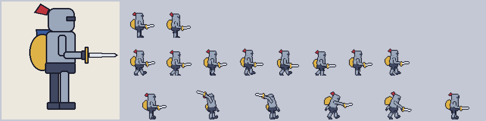

# pseudo-pixel

Turn a 2D reference image into pixel-art spritesheets, using the Dead Cells workflow:
reference -> low-detail 3D model -> rigged animation -> low-res toon render -> spritesheet.

An LLM coding agent builds the model, rig and animations in Blender, and you can edit any of them by hand
in Blender as well. It works with any agent and model that can run shell commands, write Python and read
images.



*`examples/knight`: the reference, then the idle, walk and attack sheets an agent built from it
(shown at 4x).*

**Status:** milestones 1-4 of [PLAN.md](PLAN.md) are done: render pipeline, rig and animation helpers,
modelling helpers, and the agent skill.

## Using it with an agent

Point your coding agent at the skill in [skills/pseudo-pixel/SKILL.md](skills/pseudo-pixel/SKILL.md).
Agents that load Agent Skills can install the `skills/pseudo-pixel` folder; others find it through
[AGENTS.md](AGENTS.md). Then ask for what you want, for example:

- "Make a character from `art/knight.png` with idle, walk and attack, 48x48 at 12 fps."
- "Add a hit animation to the knight."
- "Make the knight's helmet bigger" or "the attack needs more windup."
- "Render the knight at 64x64 with the Sweetie 16 palette."

The agent creates `characters/<name>/` in your project with the reference, `character.json`, the
`.blend` (the source of truth, which you can open and edit in Blender at any time), a numbered log of
the scripts it ran, review previews, and `out/` with the sheets.

## Commands

```
python pp.py new     <character_dir> <reference_image>    # new character folder + character.json
python pp.py run     <character_dir> <script.py>          # apply a script to the .blend and save it
python pp.py inspect <character_dir>                      # the .blend's objects, bones and keys as JSON
python pp.py preview <character_dir> [--turnaround] [--anim NAME ...]   # review images + checks
python pp.py render  <character_dir> [animation ...]      # spritesheets + JSON in out/
python -m unittest discover tests                         # post-processing tests (numpy only)
```

## Examples

Each example has its scripts in `scripts/`, numbered in the order they run. To rebuild one from
scratch (the first script creates the rig, so it needs a fresh .blend):

```
rm -f examples/knight/knight.blend
for s in examples/knight/scripts/*.py; do python pp.py run examples/knight "$s"; done
python pp.py preview examples/knight --turnaround
python pp.py render examples/knight
```

- `examples/knight`: an armoured humanoid with sword and shield, modelled from its reference, with
  idle, walk and attack. Its rendered sheets are committed in `out/`.
- `examples/mage`: a caped, robed humanoid with a staff.
- `examples/slime`: a non-humanoid on a custom two-bone rig, with squash-and-stretch idle and hop.
- `examples/humanoid`: the bare rig and animation test character.
- `examples/test`: the render pipeline's test character.

The reference images in the examples are simple drawings made for testing. Conventions for
modelling, rigs and animation are in [skills/pseudo-pixel/references](skills/pseudo-pixel/references).

Blender is found via the `BLENDER` environment variable, `PATH`, or the default install location.

Render settings live in the character's `character.json` under `output`, and each animation can override
them:

| Key | Default | Meaning |
|---|---|---|
| `frame` | required | Frame size in pixels, `[w, h]` |
| `pixels_per_unit` | required | Scale: pixels per Blender unit, the same for every animation |
| `fps` | required | Sprite frame rate, which is also the Blender timeline rate |
| `anchor` | `"bottom-center"` | Pixel the root's ground position maps to: `bottom-center`, `center`, `bottom-left`, or `[x, y]` |
| `shading_steps` | `3` | Toon tones per material (`1` is flat colour). Applies to the whole character |
| `light` | `[-1, -1, 1]` | Direction toward the key light (+X is screen right, -Y is toward the camera) |
| `palette` | none | List of hex colours, or a `.hex` / `.gpl` file relative to the character folder |
| `despeckle` | `false` | Remove isolated single pixels |
| `outline` | none | `{"color": "#1a1c2c", "mode": "outer" or "inner", "depth": 1}` |
| `columns` | one row | Frames per row in the sheet |
| `expand_holds` | `false` | Repeat held frames instead of giving them longer durations |
| `loop` | `false` | Per animation: the last frame repeats the first and is left out |

## Requirements

- Blender 5.2 LTS or newer
- A coding agent with a vision-capable model (Claude Code, Codex, Gemini CLI, OpenCode, etc.)

## License

MIT
